# SciML Research — Julia + Pluto Examples

[](https://github.com/caxelrud/SciML_research/actions/workflows/test-notebooks.yml)

Hands-on examples exploring the [SciML](https://sciml.ai/) ecosystem
(Scientific Machine Learning) using [Julia](https://julialang.org/) and
[Pluto.jl](https://plutojl.org/) reactive notebooks.

SciML combines classical numerical differential-equation solvers with
modern machine learning — neural networks embedded inside ODEs, automatic
discovery of governing equations from data, physics-informed neural
networks, and more.

## Notebooks

Click a thumbnail to open that notebook's rendered PDF (code, math, and
plot outputs, no Julia required) — or open the `.jl` file to run it live.

| Preview | Notebook | Topic | Key packages |
|---|---|-------|---------------|
| [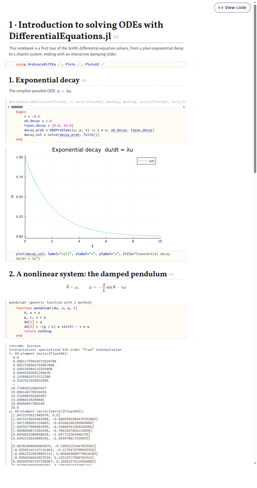](pdf/01_intro_ode_diffeq.pdf) | [`01_intro_ode_diffeq.jl`](notebooks/01_intro_ode_diffeq.jl) | Solving ODEs: exponential decay, damped pendulum, Lorenz attractor | `OrdinaryDiffEq`, `Plots` |
| [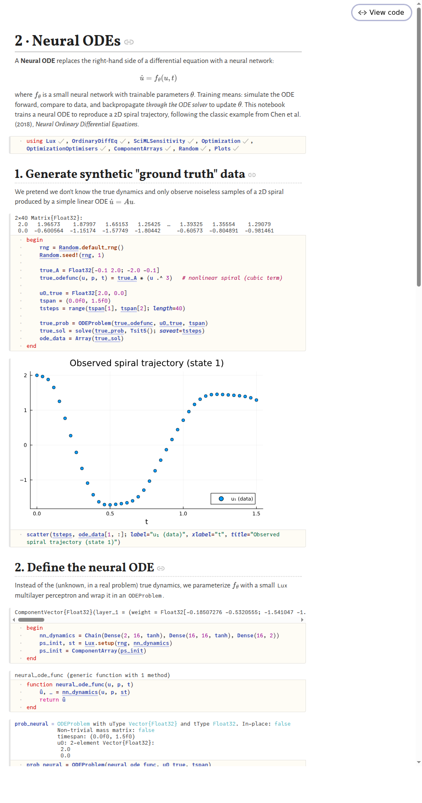](pdf/02_neural_ode.pdf) | [`02_neural_ode.jl`](notebooks/02_neural_ode.jl) | Neural ODEs: learning a spiral's dynamics with a neural network inside the ODE right-hand side | `Lux`, `SciMLSensitivity`, `Optimization` |
| [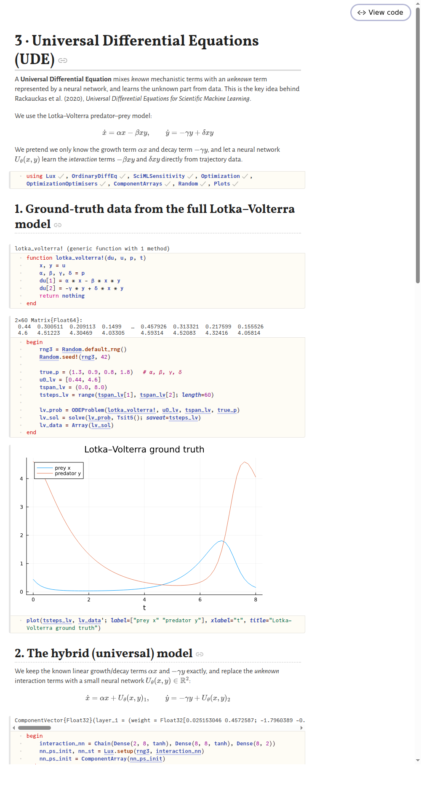](pdf/03_universal_differential_equations.pdf) | [`03_universal_differential_equations.jl`](notebooks/03_universal_differential_equations.jl) | Universal Differential Equations (UDE): mixing known physics with a learned neural correction term on Lotka–Volterra | `Lux`, `SciMLSensitivity`, `Optimization` |
| [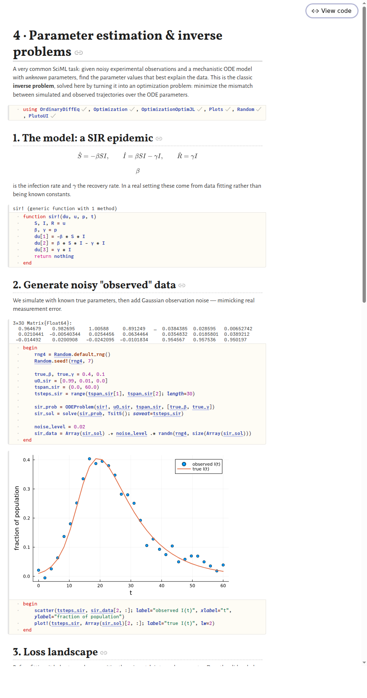](pdf/04_parameter_estimation.pdf) | [`04_parameter_estimation.jl`](notebooks/04_parameter_estimation.jl) | Inverse problems: estimating unknown ODE parameters from noisy observations | `OrdinaryDiffEq`, `Optimization` |
| [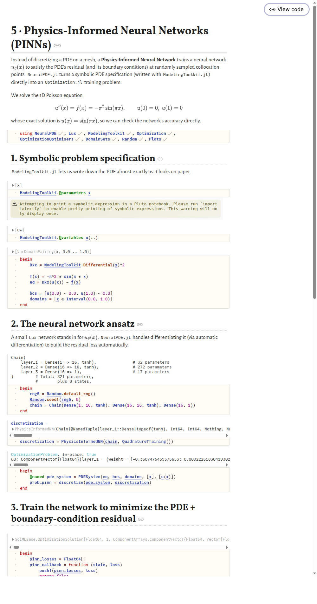](pdf/05_physics_informed_neural_networks.pdf) | [`05_physics_informed_neural_networks.jl`](notebooks/05_physics_informed_neural_networks.jl) | Physics-Informed Neural Networks (PINNs): solving a 1D Poisson PDE without a mesh | `NeuralPDE`, `Lux`, `Optimization` |
| [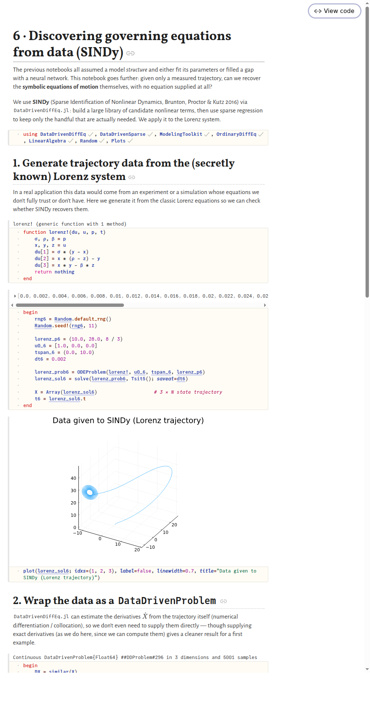](pdf/06_sindy_model_discovery.pdf) | [`06_sindy_model_discovery.jl`](notebooks/06_sindy_model_discovery.jl) | Sparse model discovery (SINDy): recovering the Lorenz equations from trajectory data | `DataDrivenDiffEq`, `OrdinaryDiffEq` |
| [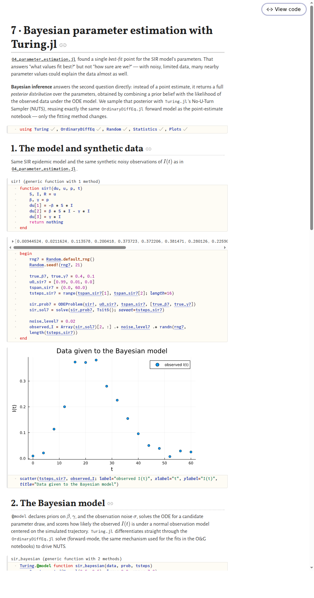](pdf/07_bayesian_parameter_estimation.pdf) | [`07_bayesian_parameter_estimation.jl`](notebooks/07_bayesian_parameter_estimation.jl) | Bayesian inference: sampling the full posterior over ODE parameters with `Turing.jl`'s NUTS sampler instead of a single point estimate | `Turing`, `OrdinaryDiffEq` |

## Oil & Gas examples

A second suite in [`notebooks/oil_gas/`](notebooks/oil_gas/) applies the same SciML
methods to petroleum engineering workflows — production forecasting, reservoir
engineering, and well testing:

| Preview | Notebook | Topic | Key packages |
|---|---|-------|---------------|
| [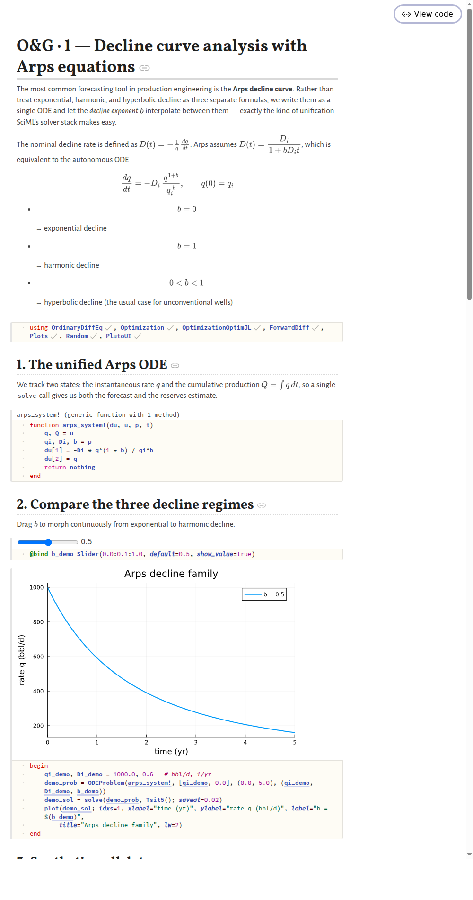](pdf/oil_gas/01_decline_curve_analysis.pdf) | [`01_decline_curve_analysis.jl`](notebooks/oil_gas/01_decline_curve_analysis.jl) | Arps decline curves as a single unified ODE; fitting $(q_i, D_i, b)$ to noisy production data and forecasting EUR to an economic limit | `OrdinaryDiffEq`, `Optimization` |
| [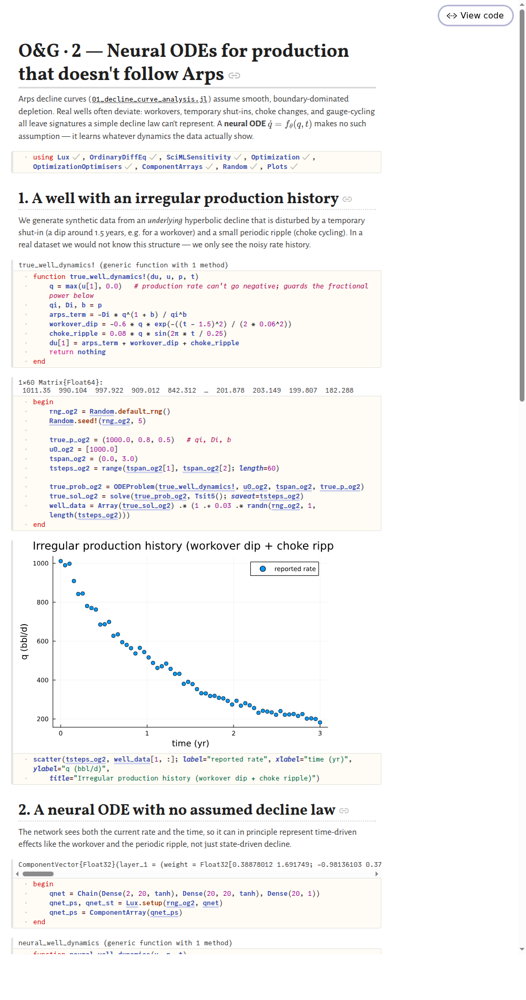](pdf/oil_gas/02_neural_decline_forecasting.pdf) | [`02_neural_decline_forecasting.jl`](notebooks/oil_gas/02_neural_decline_forecasting.jl) | Neural ODEs for wells whose production doesn't follow a clean decline law (workovers, choke cycling) | `Lux`, `SciMLSensitivity`, `Optimization` |
| [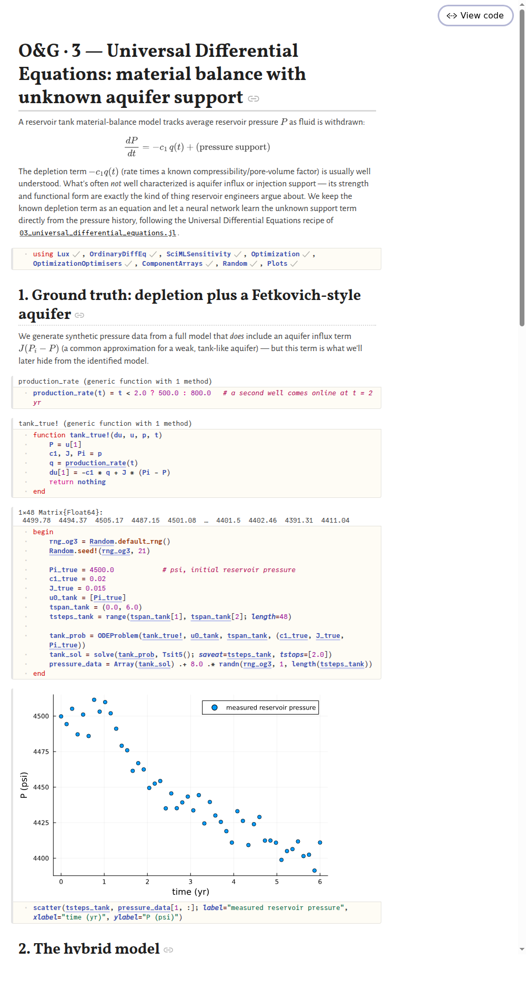](pdf/oil_gas/03_material_balance_ude.pdf) | [`03_material_balance_ude.jl`](notebooks/oil_gas/03_material_balance_ude.jl) | Universal Differential Equations: a tank material-balance model with a neural network standing in for unknown aquifer support | `Lux`, `SciMLSensitivity`, `Optimization` |
| [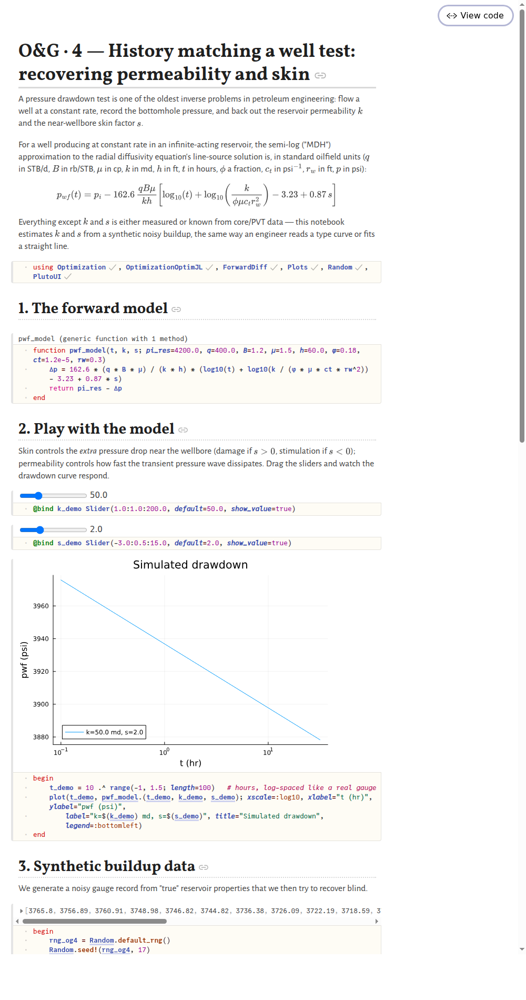](pdf/oil_gas/04_well_test_history_matching.pdf) | [`04_well_test_history_matching.jl`](notebooks/oil_gas/04_well_test_history_matching.jl) | History matching: recovering permeability and skin from a pressure drawdown test (the semi-log/MDH method) | `Optimization`, `ForwardDiff` |
| [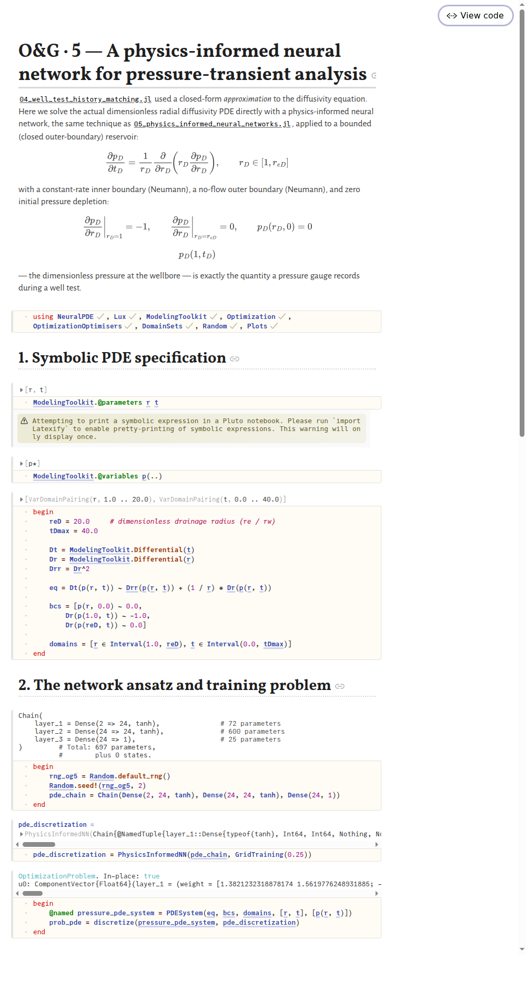](pdf/oil_gas/05_pressure_transient_pinn.pdf) | [`05_pressure_transient_pinn.jl`](notebooks/oil_gas/05_pressure_transient_pinn.jl) | A physics-informed neural network solving the radial diffusivity (pressure-transient) PDE for a bounded reservoir | `NeuralPDE`, `Lux`, `Optimization` |
| [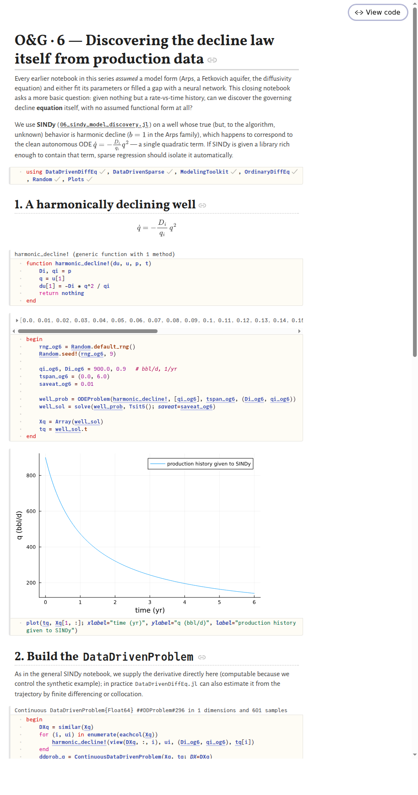](pdf/oil_gas/06_sindy_decline_law_discovery.pdf) | [`06_sindy_decline_law_discovery.jl`](notebooks/oil_gas/06_sindy_decline_law_discovery.jl) | Discovering the governing decline ODE directly from a rate history, with no assumed Arps form | `DataDrivenDiffEq`, `OrdinaryDiffEq` |
| [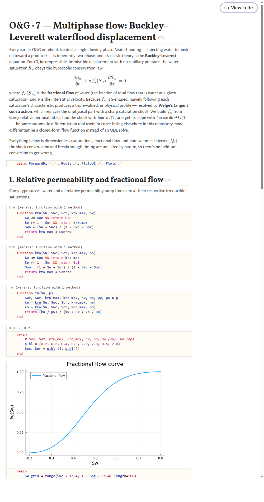](pdf/oil_gas/07_multiphase_flow_buckley_leverett.pdf) | [`07_multiphase_flow_buckley_leverett.jl`](notebooks/oil_gas/07_multiphase_flow_buckley_leverett.jl) | Multiphase flow: the Buckley–Leverett waterflood displacement, solved via Welge's tangent construction (`Roots.jl` + `ForwardDiff.jl`) instead of a mesh-based simulator | `ForwardDiff`, `Roots` |

These mirror the general notebooks 1–6 one-for-one, applied to production
forecasting, reservoir tank modeling, well testing, and model discovery instead
of epidemiology, spirals, and the Lorenz system. Notebook 7 in each suite
branches out on its own: Bayesian uncertainty quantification for the general
set, and multiphase (two-phase) flow for the O&G set.

Each notebook is self-contained: it declares its own dependencies in a
`using`/`import` cell, and Pluto's built-in package manager resolves and
installs an isolated environment for that notebook the first time you open
it (no manual `Pkg.add` needed, but the first run does need internet
access and will take a while to precompile).

## Running the notebooks

1. Install Julia (recommended via [juliaup](https://github.com/JuliaLang/juliaup)):

   ```bash
   curl -fsSL https://install.julialang.org | sh
   ```

2. Install Pluto:

   ```bash
   julia -e 'import Pkg; Pkg.add("Pluto")'
   ```

3. Launch Pluto and open a notebook:

   ```bash
   julia -e 'import Pluto; Pluto.run()'
   ```

   Then open the desired file from `notebooks/` in the browser tab that
   appears. The first cell run per notebook will download and precompile
   its packages — this is one-time and can take several minutes,
   especially for the PINN and neural ODE notebooks.

## Suggested order

The notebooks are numbered to build on each other conceptually:
start with plain ODE solving (1), then see how a neural network can
replace or augment part of a differential equation (2–3), how to fit
model parameters to data (4), how PDEs can be solved without a mesh via
neural networks (5), and finally how to go the other direction — discover
symbolic governing equations directly from data (6). The `oil_gas/`
notebooks follow the same six-step arc grounded in production forecasting
and reservoir/well-test engineering, and can be read either alongside their
general-purpose counterpart or on their own.

## Continuous integration

Every push and pull request runs each notebook end-to-end in CI
(`.github/workflows/test-notebooks.yml`), not just a syntax check. A
notebook file's `# ╔═╡ <uuid>` cell markers are plain comments, so the
whole file is ordinary top-to-bottom Julia source once opened outside
Pluto — CI installs whatever the notebook's own `using` line asks for
and `include`s it, and any thrown exception fails the job with a full
stack trace. This is the same class of check that caught real bugs
during development (type mismatches, wrong function signatures, a
domain that made a PDE solver never converge) that a plain syntax check
cannot see. See [`ci/run_notebook.jl`](ci/run_notebook.jl) and
[`ci/syntax_check.jl`](ci/syntax_check.jl).

## References

- [SciML documentation](https://docs.sciml.ai/)
- [DifferentialEquations.jl](https://docs.sciml.ai/DiffEqDocs/stable/)
- [SciMLSensitivity.jl](https://docs.sciml.ai/SciMLSensitivity/stable/) (neural/universal differential equations)
- [NeuralPDE.jl](https://docs.sciml.ai/NeuralPDE/stable/) (physics-informed neural networks)
- [DataDrivenDiffEq.jl](https://docs.sciml.ai/DataDrivenDiffEq/stable/) (SINDy / sparse model discovery)
- [Optimization.jl](https://docs.sciml.ai/Optimization/stable/)
- [Pluto.jl](https://plutojl.org/)
